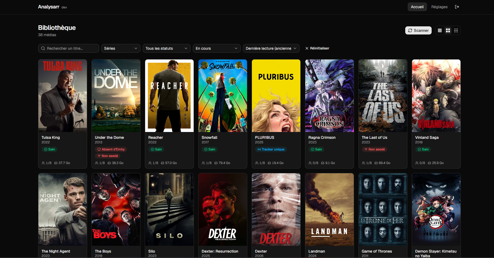
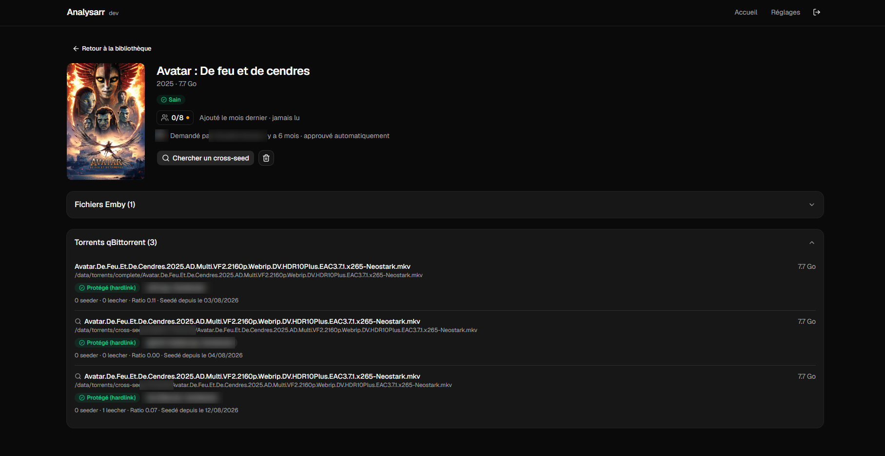

<p align="center">
  
</p>

<h1 align="center">Analysarr</h1>

<p align="center">
  <strong>Le tableau de bord de santé de votre stack média.</strong><br>
  Emby ou Jellyfin · Sonarr · Radarr · qBittorrent, Deluge ou Transmission · Seer · cross-seed
</p>

<p align="center">
  <a href="https://github.com/SEC844/Analysarr/releases/latest"></a>
  <a href="https://github.com/SEC844/Analysarr/actions/workflows/ci.yml"></a>
  <a href="https://github.com/SEC844/Analysarr/pkgs/container/analysarr"></a>
  <a href="LICENSE"></a>
  <a href="https://github.com/SEC844/Analysarr/stargazers"></a>
</p>

<p align="center">
  <a href="README.md">Read in English</a>
</p>

---

Analysarr affiche, pour chaque film et chaque série, son état dans toute votre stack — et permet d'agir en quelques clics au lieu de jongler entre quatre interfaces.

- Ce film est-il **toujours seedé**, et le torrent est-il **protégé par un hardlink** vers la bibliothèque ?
- Quels fichiers sont des **doublons** laissés par un upgrade Sonarr/Radarr ?
- Quels torrents sont **orphelins** (ancienne qualité, plus rien n'y est lié) ?
- Qui l'a **regardé**, qui l'a **demandé**, et combien d'espace sa suppression libérerait **réellement** ?

> **Analysarr vous plaît ?** Laissez-lui une ⭐ sur [GitHub](https://github.com/SEC844/Analysarr) : cela aide d'autres personnes à découvrir le projet et encourage son développement.

<p align="center">
  
</p>
<p align="center">
  
</p>

## Fonctionnalités

**Détection**
- Doublons, torrents orphelins, hardlinks manquants, contenu seedé sur un seul tracker, médias absents du serveur multimédia ou non seedés.
- **Imports bloqués** : les téléchargements que Sonarr/Radarr a terminés mais n'a pas réussi à ranger ont leur propre statut, avec le motif donné par Sonarr/Radarr et une relance en un clic — le média concerné n'est plus signalé absent du serveur multimédia, et son téléchargement n'est jamais proposé au nettoyage.
- **Téléchargements en souffrance** : un téléchargement qui n'avance plus est signalé sur la fiche du média, avec son motif. Purement informatif : Analysarr ne supprime ni ne relance jamais un téléchargement.
- Rattachement torrent ↔ média par inode d'abord (fonctionne pour les copies cross-seed rangées hors des dossiers Sonarr/Radarr), puis historique Sonarr/Radarr, puis similarité de titre.
- Trackers de chaque torrent, passkeys masquées.

**Actions — toujours avec aperçu et confirmation explicite**
- Nettoyage en cascade des doublons et orphelins.
- Suppression sélective (torrents, épisodes, saisons, série entière ou film) avec l'espace disque **réellement** libéré, hardlinks pris en compte.
- Retrait optionnel de Sonarr/Radarr et de Seer (jamais d'ajout en liste d'exclusion).
- Réparation des hardlinks en un clic, avec repli par lien symbolique entre systèmes de fichiers.
- Relance d'un import bloqué (rien n'est supprimé : le fichier déjà sur le disque est simplement redonné à Sonarr/Radarr).
- Retrait d'un média dont il ne reste rien sur le disque, de Sonarr/Radarr et de Seer.
- Recherche cross-seed ciblée par épisode, saison ou série intégrale.

**Aide à la décision**
- Visionnage par utilisateur (`3/10` l'ont vu, progression au survol), dernière lecture, date d'ajout.
- Demandes Seer : qui a demandé, quand, qui a approuvé.
- Tri « candidats au nettoyage » : les gros fichiers que personne n'a regardés depuis longtemps.

**Confort au quotidien**
- Scans planifiés, historique des scans, diagnostic des chemins qui désigne le montage Docker manquant.
- qBittorrent, Deluge ou Transmission : le client torrent est un réglage, tout le reste fonctionne à l'identique.
- Plusieurs instances Sonarr et Radarr (ex : un Radarr dédié à la 4K) : chaque média reste rattaché à l'instance qui le suit, et une version suivie par une autre instance n'est jamais comptée comme un doublon.
- Fichiers de la bibliothèque rapprochés de Sonarr/Radarr même quand les conteneurs montent la bibliothèque à des chemins différents.
- État de connexion de chaque service dans les réglages, avec une alerte dans l'en-tête dès qu'un service ne répond plus.
- Widget de tableau de bord en lecture seule (`/api/status`) pour Homepage, Homarr ou tout outil capable de lire du JSON.
- Notifications détaillées sur Discord, ntfy ou Gotify (jaquette, espace libéré, résultat de chaque étape). Plusieurs canaux, chacun avec ses propres événements : scan terminé, échec de scan, orphelins détectés, suppression, nettoyage, réparation des hardlinks, recherche cross-seed, automatisation.
- Automatisations optionnelles : sur orphelins, doublons, torrents non hardlinkés ou imports bloqués, nettoyer, réparer, relancer l'import, chercher un cross-seed ou simplement notifier — avec conditions (ancienneté du seed, ratio, type de média, espace récupérable), mode simulation et plafond par exécution.
- Historique des actions : chaque suppression, nettoyage, réparation et recherche cross-seed, avec son résultat détaillé.
- Interface en français et en anglais, thème sombre/clair, préférences d'affichage.
- Notification quand une nouvelle version est publiée.

## Compatibilité

| Service | Versions | Requis |
|---|---|---|
| Emby | 4.x | Emby ou Jellyfin |
| Jellyfin | 10.9 ou plus récent | Emby ou Jellyfin |
| Sonarr | v3, v4 | Oui |
| Radarr | v3 ou plus récent | Oui |
| qBittorrent | 4.1 ou plus récent (WebUI API v2) | Un client torrent |
| Deluge | 2.x (interface web) | Un client torrent |
| Transmission | 3.0 ou plus récent (RPC) | Un client torrent |
| Seer (Overseerr, Jellyseerr, Seerr) | Versions actuelles | Optionnel |
| cross-seed | Mode daemon | Optionnel |

## Démarrage rapide

### Docker Compose

```yaml
services:
  analysarr:
    image: ghcr.io/sec844/analysarr:latest
    container_name: analysarr
    restart: unless-stopped
    ports:
      - "1818:1818"
    environment:
      DATABASE_PATH: /config/analysarr.db
    volumes:
      - ./analysarr:/config
      # Même chemin hôte ET même chemin conteneur que dans votre serveur
      # multimédia, qBittorrent, Sonarr et Radarr (voir « Chemins et hardlinks »).
      - /mnt/data:/data
```

### Unraid

Cherchez **Analysarr** dans l'onglet **Apps** (Community Applications).

Sans Community Applications : Docker → **Add Container** → collez l'URL du template :

```
https://raw.githubusercontent.com/SEC844/unraid-templates/main/templates/analysarr.xml
```

### Premier lancement

Ouvrez `http://<hôte>:1818`, créez le compte administrateur, puis suivez l'assistant de configuration : serveur multimédia, Sonarr, Radarr, client torrent, chemins des dossiers, puis cross-seed et Seer si vous les utilisez (les deux sont facultatifs). Un récapitulatif final indique ce qui est prêt et ce qui manque encore.

Aucun fichier de configuration à éditer : tout se règle depuis l'interface, avec un bouton **Tester la connexion** pour chaque service et un bouton **Parcourir** pour chaque chemin. Une fois l'assistant terminé, lancez un premier scan depuis la bibliothèque.

## Chemins et hardlinks

C'est le seul point à soigner. Analysarr compare les fichiers vus par votre serveur multimédia et par votre client torrent **depuis son propre conteneur**. Il doit donc voir **exactement les mêmes chemins** que ces conteneurs :

| Conteneur | Chemin hôte | Chemin conteneur |
|---|---|---|
| Emby / Jellyfin | `/mnt/data` | `/data` |
| qBittorrent / Deluge / Transmission | `/mnt/data` | `/data` |
| Sonarr / Radarr | `/mnt/data` | `/data` |
| **Analysarr** | `/mnt/data` | `/data` |

C'est l'organisation recommandée par les [TRaSH Guides](https://trash-guides.info/File-and-Folder-Structure/). Si vos conteneurs utilisent d'autres chemins, reproduisez-les à l'identique. **Réglages → Chemins → Diagnostic des chemins** signale immédiatement un montage manquant, et lequel.

L'accès en écriture aux données ne sert qu'à la suppression de médias et à la réparation des hardlinks, toujours après confirmation.

## Widget de tableau de bord

Générez une clé dans **Réglages → Configuration → Widget**, puis interrogez `http://<hôte>:1818/api/status` avec l'en-tête `X-Api-Key` (ou `Authorization: Bearer`). La réponse ne contient que des compteurs : total des médias, films, séries, médias sains, médias par statut, espace récupérable, dernier scan et état des services. Exemple pour [Homepage](https://gethomepage.dev/widgets/services/customapi/) :

```yaml
- Analysarr:
    href: http://analysarr:1818
    widget:
      type: customapi
      url: http://analysarr:1818/api/status
      headers:
        X-Api-Key: VOTRE_CLE
      mappings:
        - field: { media: total }
          label: Médias
        - field: { statuses: doublon }
          label: Doublons
        - field: reclaimable_bytes
          label: Récupérable
          format: bytes
```

## Mise à jour

Téléchargez la nouvelle image et recréez le conteneur. Réglages et cache sont conservés dans `/config`. L'interface signale quand une nouvelle version est disponible (**Réglages → Application**, désactivable).

**Mise à jour depuis une version antérieure à 0.19.0 ?** Le port par défaut passe de 8000 à **1818**. Adaptez la redirection de port (`1818:1818`, ou le port du conteneur sur Unraid), ou définissez la variable d'environnement `PORT=8000` pour garder l'ancien port.

## Sécurité

- Un seul compte administrateur ; mots de passe hachés avec bcrypt ; connexion bloquée 15 minutes après 5 échecs.
- Double authentification optionnelle (application TOTP) avec codes de secours à usage unique.
- Les automatisations ne tournent que si vous créez une règle : une nouvelle règle démarre en simulation, chaque exécution est plafonnée, et elles réutilisent les actions manuelles — un torrent protégé ou réparable n'est jamais supprimé.
- Le widget exige sa propre clé (stockée hachée, acceptée uniquement dans un en-tête), n'expose que des compteurs (aucun titre, chemin ni adresse de service) et ne déclenche jamais de requête vers vos services.
- Sessions stockées côté serveur, transmises par cookie `httpOnly`.
- Les clés API et mots de passe de vos services restent sur le serveur : ils ne sont jamais renvoyés au navigateur.
- Seules connexions sortantes : les services que vous configurez (canaux de notification compris), et une vérification optionnelle des mises à jour auprès de l'API GitHub (seule la version d'Analysarr est transmise).
- Webhooks et jetons de notification ne sont jamais renvoyés non plus ; seules les URL officielles de webhook Discord sont acceptées, et le test n'envoie que vers les canaux enregistrés.
- Analysarr peut supprimer des fichiers : ne l'exposez pas directement sur internet. Placez-le derrière un reverse proxy en HTTPS, ou gardez-le sur votre réseau local / VPN.

Une faille de sécurité ? Signalez-la de façon privée, voir [SECURITY.md](SECURITY.md).

## FAQ

**Analysarr supprime-t-il quelque chose tout seul ?**
Non. Les scans sont en lecture seule. Chaque suppression ou réparation affiche un aperçu et attend votre confirmation.

**Des torrents sont « non évalués » ou des chemins sont inaccessibles.**
Un montage manque ou diffère de vos autres conteneurs. Lancez **Réglages → Chemins → Diagnostic des chemins** : il indique le dossier invisible depuis Analysarr.

**Le test de connexion indique « le serveur à cette adresse est Jellyfin, pas Emby ».**
Choisissez le bon serveur multimédia en haut de sa carte dans les Réglages.

**Seer ou cross-seed sont-ils nécessaires ?**
Non. Les deux sont optionnels et totalement masqués tant qu'ils ne sont pas activés.

## Contribuer

Les contributions sont les bienvenues — lisez d'abord [CONTRIBUTING.md](CONTRIBUTING.md).

## Licence

[GNU AGPL-3.0](LICENSE). Vous pouvez utiliser, modifier et partager Analysarr ; toute version modifiée distribuée ou proposée en service doit rester open source sous la même licence.
